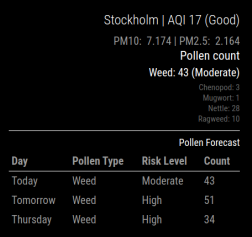
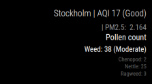

# MMM-airquality

[](https://ko-fi.com/J3J2EARPK)


A module for the [MagicMirror²](https://magicmirror.builders) to display air quality and Pollen information using data from the ambee API. This module provides real-time air quality index (AQI), other pollutants and pollen related data.

## Screenshots

 

## Installation

Just clone the module into your modules directory:

```bash
cd ~/MagicMirror/modules
git clone https://github.com/PierreGode/MMM-airquality
```

## Update

Just enter the module's directory and pull the update:

```bash
cd ~/MagicMirror/modules/MMM-airquality
git pull
```

## Configuration

To use this module, you need to configure it in your config.js file of MagicMirror.

You can obtain an API key from [ambee API](https://auth.ambeedata.com/users/register?redirectUrl=https://api-dashboard.getambee.com)

### Configuration Example

Here is an example of the configuration:

```js
{
  module: "MMM-airquality",
  position: "bottom_right",
  config: {
    apiKey: "YOUR_TOMORROW_IO_API_KEY",  // Replace with your Tomorrow.io API Key
    latitude: "59.3293",                 // Latitude of your location (e.g., Stockholm)
    longitude: "18.0686",                // Longitude of your location
    showPM10: true,                      // Show PM10 data
    showPM25: true,                      // Show PM2.5 data
    updateInterval: 3600000,             // Update every hour (max 24 calls/day with Tomorrow.io)
    animationSpeed: 1000,                // 1 second for DOM animations
    showPollenForecast: true,            // Control pollen forecast display
    showGrassPollen: true,               // Option to show or hide Grass pollen
    showTreePollen: true,                // Option to show or hide Tree pollen
    showWeedPollen: true,                // Option to show or hide Weed pollen
    startsilentHour: 23,                 // Begin ignore period at 23:00
    endsilentHour: 6,                    // End ignore period at 06:00
    debug: false                         // Set to true to enable logging for debugging
  },
},

```
### Options
Setting silent hours between 23 and 06 will allow you yo have more calls during daytime: updateInterval: 1855000, // 1,855,000 milliseconds = 30.9 minutes

### Configuration Options

| Option | Description |
| --- | --- |
| `apiKey` | **Required**: Your AirVisual API key. Get it from here. |
| `latitude` | **Required**: Your location's latitude. Example: `"59.3293"` for Stockholm. |
| `longitude` | **Required**: Your location's longitude. Example: `"18.0686"` for Stockholm. |
| `showPM10` | Show or Hide ( true : false )  PM10 data. |
| `showPM25` | Show or Hide ( true : false ) PM10 data. |

## Errors

[ERROR]
[MMM-airquality] Error fetching pollen data: 422: <p>This will mean that you have reached your 100 daily API call limmit. try setting updateInterval: to a higher number.
